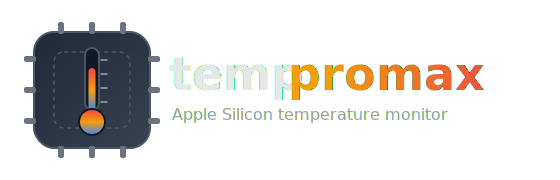

<p align="center">
  
</p>

# temppromax

`temppromax` is a macOS command-line temperature monitor for Apple Silicon Macs. It reads PMU temperature sensors through the HID Event System and does not require sudo, launchd, or any privileged helper.

## How it compares

Most temperature tools predate Apple Silicon and rely on the SMC private API, which is no longer the temperature source on M-series Macs. `temppromax` instead uses `IOHIDEventSystemClient` — the same approach Stats.app uses — to read PMU sensors surfaced as HID events.

| Tool | API used | Apple Silicon | sudo | Entitlements | Daemon | Over SSH |
| --- | --- | --- | --- | --- | --- | --- |
| **temppromax** | `IOHIDEventSystemClient` (HID events) | ✅ | ❌ none | ❌ none | ❌ none | ✅ |
| `osx-cpu-temp` | SMC private API (`IOServiceOpen`) | ❌ prints 0°C | ❌ | ❌ | ❌ | ✅ |
| `istats` | SMC private API | ❌ | ❌ | ❌ | ❌ | ✅ |
| `powermetrics` | built-in sampler | ⚠️ verbose firehose | ✅ required | ❌ | ❌ | ⚠️ needs `-t` + TTY |
| SMC private API | `IOServiceOpen("AppleSMC")` | ❌ `kIOReturnNotAllowed` | — | — | — | — |
| `IOHIDManager` | standard HID API | ⚠️ | ✅ or | `com.apple.hid.manager.user-access` | ❌ | ✅ |

### Approaches that did not work

- **`osx-cpu-temp` (Homebrew)** — reads SMC keys via the private `IOServiceOpen`/`IOConnectCallStructMethod` API. Prints **0°C** on Apple Silicon. It was written for Intel Macs, where the SMC (`AppleSMC`) is the temperature source; on M-series it no longer is.
- **`istats` (Homebrew)** — same fundamental problem. Relies on the SMC private API and doesn't work on Apple Silicon at all.
- **`powermetrics` (built-in)** — `sudo powermetrics --samplers smc` works if you have a TTY. Over SSH it needs the `-t` flag and interactive password entry, requires root for all samplers, and emits a firehose of data that needs heavy parsing. Not a clean CLI tool.
- **SMC private API (`AppleSMC` via `IOServiceOpen`)** — the path `osx-cpu-temp`, `istats`, and Stats.app (on Intel) use. On macOS 26, `IOServiceOpen` returns `kIOReturnNotAllowed` (`0xe00002c2`) even as root on Apple Silicon; the SMC driver refuses non-Apple clients. Dead on Apple Silicon.
- **`IOHIDManager` (standard HID API)** — needs either the `com.apple.hid.manager.user-access` entitlement (requires a signed app) or root/sudo. Neither works for a simple no-sudo CLI tool.

### What works: `IOHIDEventSystemClient`

The breakthrough came from reverse-engineering how Stats.app reads temperatures on Apple Silicon. It uses `IOHIDEventSystemClient` from `<IOKit/hidsystem/IOHIDEventSystemClient.h>` — a completely different API from the SMC path:

```objc
#include <IOKit/hidsystem/IOHIDEventSystemClient.h>
#include <IOKit/hidsystem/IOHIDServiceClient.h>

IOHIDEventSystemClientRef client = IOHIDEventSystemClientCreate(kCFAllocatorDefault);
// Match PMU temperature sensors: usage page 0xFF00, usage 5
IOHIDEventSystemClientSetMatching(client, @{@(0xFF00): @(5)});
CFArrayRef services = IOHIDEventSystemClientCopyServices(client);
// for each service:
IOHIDEventRef event = IOHIDServiceClientCopyEvent(service, 15, 0, 0);
double celsius = IOHIDEventGetFloatValue(event, 15 << 16);
```

Key properties:

- ✅ **No sudo** — works as any user on Apple Silicon.
- ✅ **No entitlements** — completely public API, just link `IOKit.framework`.
- ✅ **No launchd daemon** — pure user-space, one-shot binary.
- ✅ **Hardware temperature** — reads actual die temps (tdie0–tdie10), device temps (tdev1–tdev8), and surface temps (TP0s–TP3g).
- ✅ **Works over SSH** — no TTY needed.

The PMU temperature sensors are surfaced as HID events by the firmware on Apple Silicon — a System Management Controller vestige now baked into the HID subsystem. Apple never documents it, but Stats.app has used this API for years.

## Build

```sh
swift build
```

The debug binary is written to:

```sh
.build/debug/temppromax
```

## Usage

```sh
temppromax [--die] [--json] [--watch[=N] | -w N] [--no-color]
```

Options:

- `--die`: only show die temperature sensors.
- `--json`: print JSON.
- `--watch[=N]` or `-w N`: refresh in place every `N` seconds.
- `--no-color`: disable ANSI color.

If no PMU sensors are available, the tool exits with:

```txt
Not an Apple Silicon Mac or sensors unavailable
```
